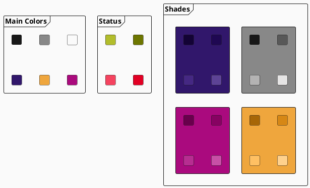

# Proveo's Identity

```plantuml
@startuml
<style>
  root {
    FontName Padauk;
    BackgroundColor #FAFAFA;
  }
</style>
frame "Main Colors" {
  rectangle " " as Black #181818
  rectangle " " as Gray #888888
  rectangle " " as White #FAFAFA
  rectangle " " as Main #31176B
  rectangle " " as Alt #EFA63D
  rectangle " " as Accent #AA0A7D
}

frame "Status" {
  rectangle " " as SuccessLight #B2BD2B
  rectangle " " as SuccessDark #6D7600
  rectangle " " as ErrorLight #F5435F
  rectangle " " as ErrorDark #E20024
}

frame "Shades" {
  rectangle #888888 {
    rectangle " " as Gray1 #181818
    rectangle " " as Gray2 #585858
    rectangle " " as Gray3 #B4B3B3
    rectangle " " as Gray4 #E5E4E4
  }
    
  rectangle #31176B {
    rectangle " " as Main1 #130335
    rectangle " " as Main2 #1F0852
    rectangle " " as Main3 #452883
    rectangle " " as Main4 #5D4395
  }
    
  rectangle #EFA63D {
    rectangle " " as Alt1 #A76607
    rectangle " " as Alt2 #D68715
    rectangle " " as Alt3 #FFC063
    rectangle " " as Alt4 #FFD18D
  }
  
  rectangle #AA0A7E {
    rectangle " " as Accent1 #69004C
    rectangle " " as Accent2 #870262
    rectangle " " as Accent3 #B72D91
    rectangle " " as Accent4 #C750A6
  }
}

@enduml
```

