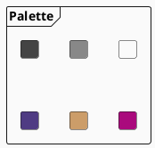

# Proveo's Identity

```plantuml
@startuml
<style>
  root {
    FontName Padauk;
    BackgroundColor #FAFAFA;
  }
</style>
frame "Palette" {
  rectangle " " as GrayScale1 #444
  rectangle " " as GrayScale2 #888
  rectangle " " as GrayScale3 #FAFAFA
  rectangle " " as Main #4F3B83
  rectangle " " as Alt #CC9D69
  rectangle " " as Accent #AA0A7D
}
@enduml
```

