# Proveo's Identity

## Colors
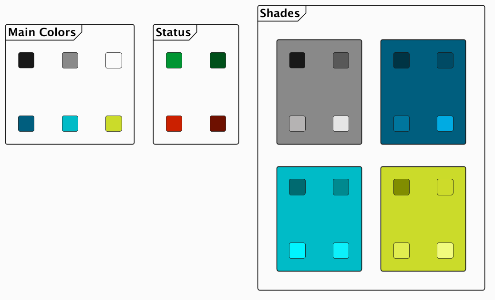

## PlantUML theme

Include the theme straight from this repo:

```puml
' light
!include https://raw.githubusercontent.com/proveo-ca/identity/refs/heads/main/proveo.puml
' dark
!include https://raw.githubusercontent.com/proveo-ca/identity/refs/heads/main/proveo-dark.puml
```

Both files share the same palette, role colours and macros — only the
canvas changes. No font is set, so PlantUML's default face is used; reach
for Creole modifiers (`""mono""`, `**bold**`, `//italic//`) for inline emphasis.

### Roles & arrows

Tag any node with a **role stereotype**, and connect nodes with a
**semantic arrow macro** — intent is carried by line style (bold / dotted /
dashed), not colour alone, so it survives greyscale and colour-blind viewing.

```puml
component "apps/api" as API <<app>>
queue     "Event Bus" as BUS <<async>>
database  "Postgres"   as PG  <<db>>
cloud     "LLM Vendor" as LLM <<cloud>>

API ARROW_QUEUE BUS : enqueue
API ARROW_CLOUD LLM : call model
API ARROW_ERROR PG  : on failure
```

| Stereotype  | Colour        | Arrow macro      | Line style        |
| ----------- | ------------- | ---------------- | ----------------- |
| `<<app>>`   | Main (teal)   | `ARROW_MAIN`     | bold              |
| `<<async>>` | Accent (lime) | `ARROW_OPTIONAL` | dotted            |
| `<<host>>`  | Alt (cyan)    | `ARROW_QUEUE`    | bold, lime        |
| `<<cloud>>` | Gray (slate)  | `ARROW_CLOUD`    | dashed            |
| `<<db>>`    | Light gray    | `ARROW_ERROR`    | bold, red         |
| `<<error>>` | Red           |                  |                   |

### Examples

**Service topology** — stereotypes + every arrow macro:

| Light | Dark |
| --- | --- |
| 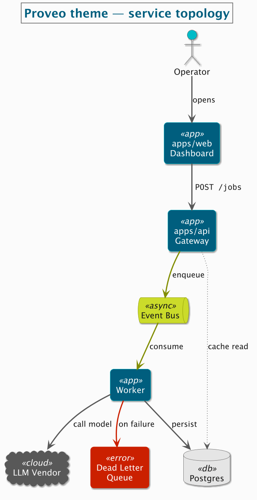 | 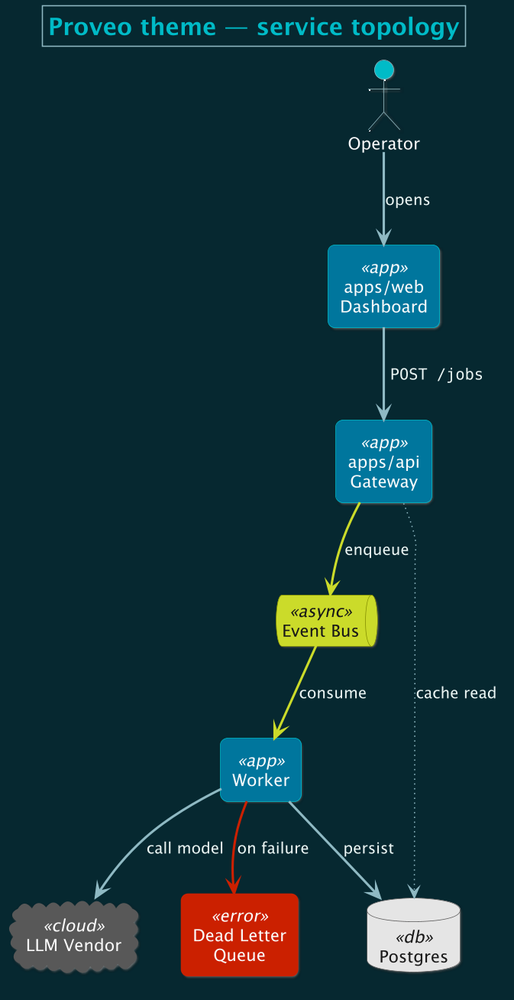 |

**Session lifecycle** — semantic arrows on a state machine:

| Light | Dark |
| --- | --- |
| 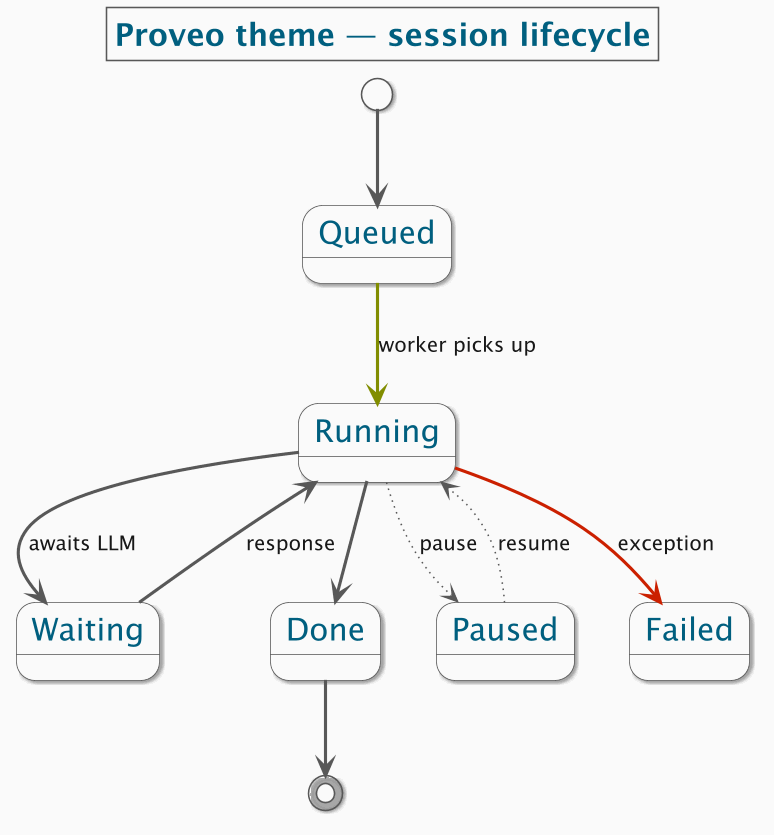 | 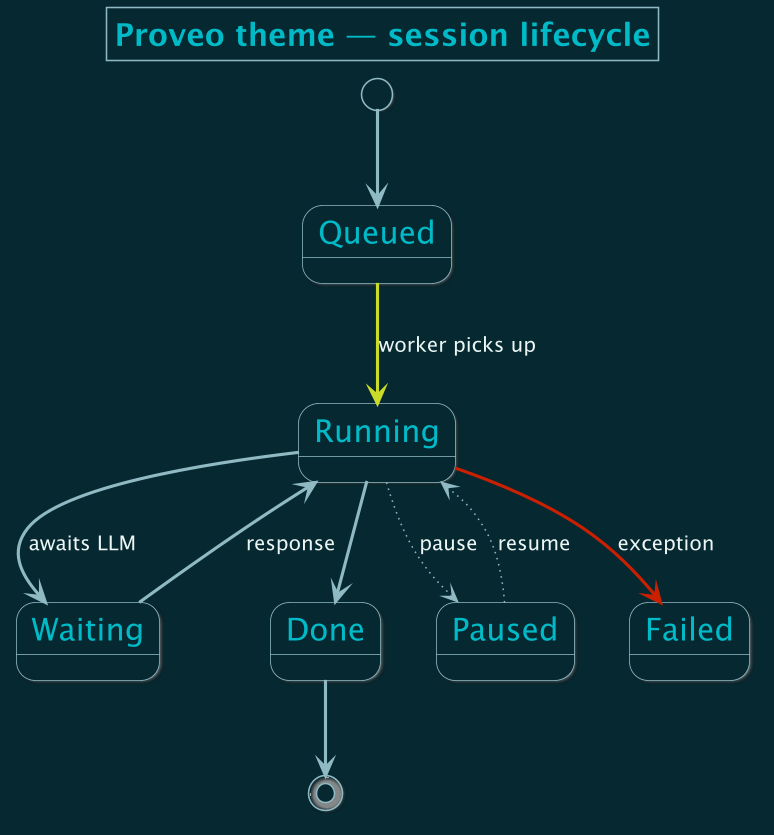 |

**Architecture sample** — the full theme on a larger diagram:

Light
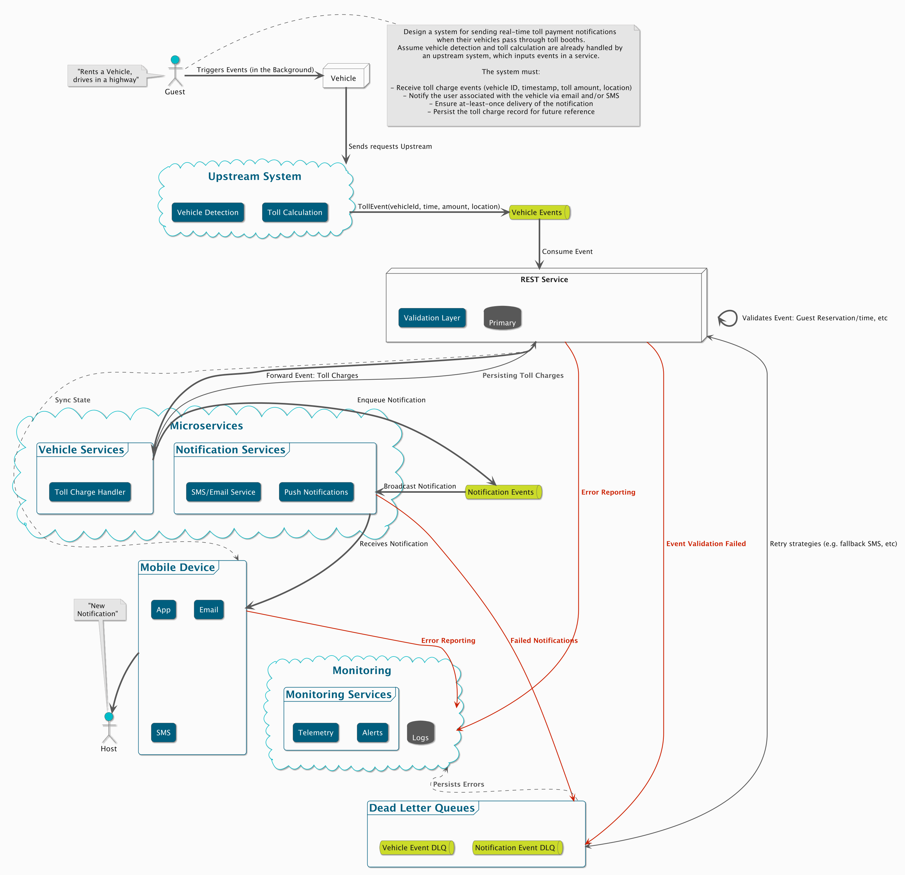
Dark
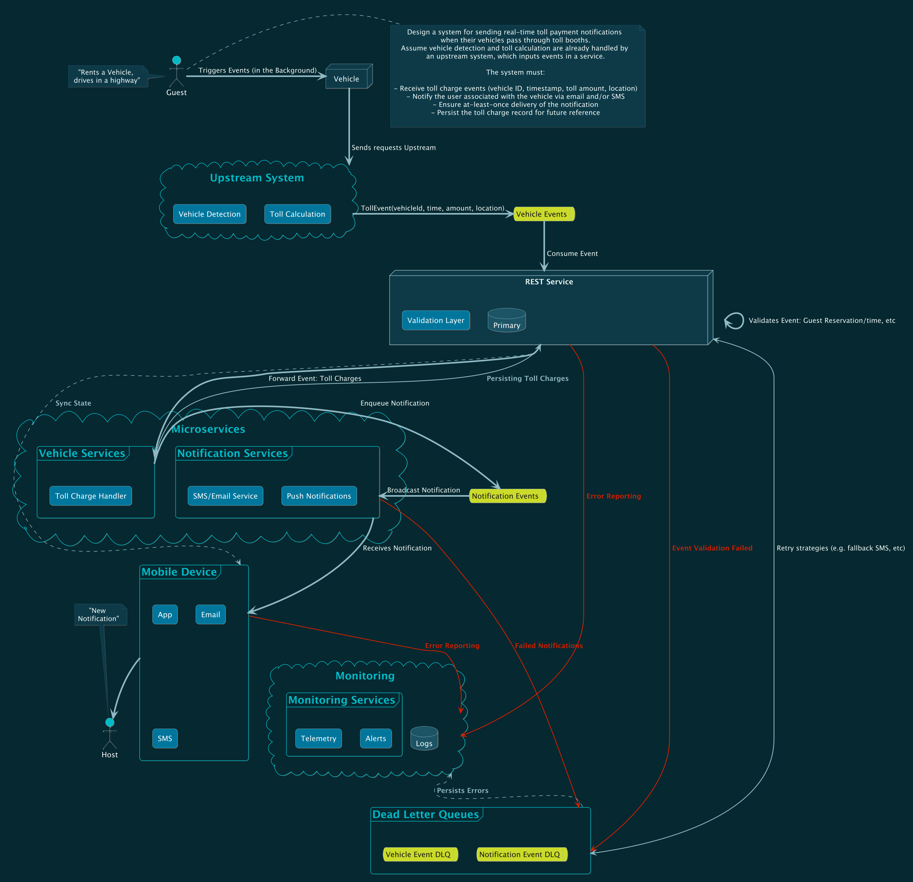

The source for every example lives in [`examples/`](examples/).

## Mermaid theme

For Mermaid diagrams, prepend the init block in
[`proveo.mermaid`](proveo.mermaid) — it maps the same palette to Mermaid's
theme variables and ships `app` / `async` / `host` / `cloud` / `db` / `error`
class definitions that match the PlantUML stereotypes.

## Vega-Lite theme

For Vega-Lite charts, use [`proveo.vega.json`](proveo.vega.json) (light) or
[`proveo-dark.vega.json`](proveo-dark.vega.json) (dark) as the chart `config`.
They carry the palette as the `category` / `ordinal` / `ramp` / `heatmap` /
`diverging` colour ranges, plus axis, legend, title and mark defaults.

```js
import spec from "./chart.json" with { type: "json" };
import config from "./proveo.vega.json" with { type: "json" };
vegaEmbed("#chart", spec, { config });
```

Or merge it straight into a spec: `{ ...spec, "config": <proveo.vega.json> }`.

### Examples

**Bars** — the categorical palette · **Lines** — multi-series:

| Light | Dark |
| --- | --- |
| 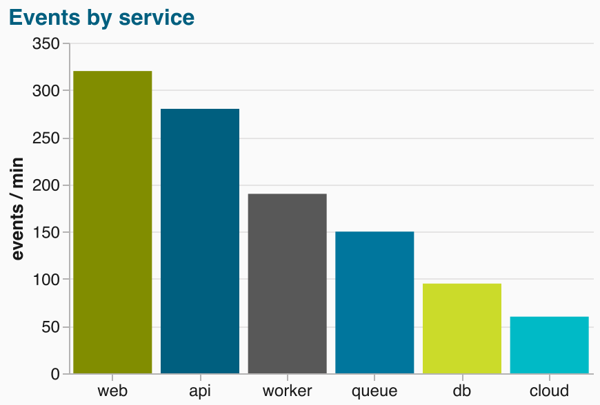 | 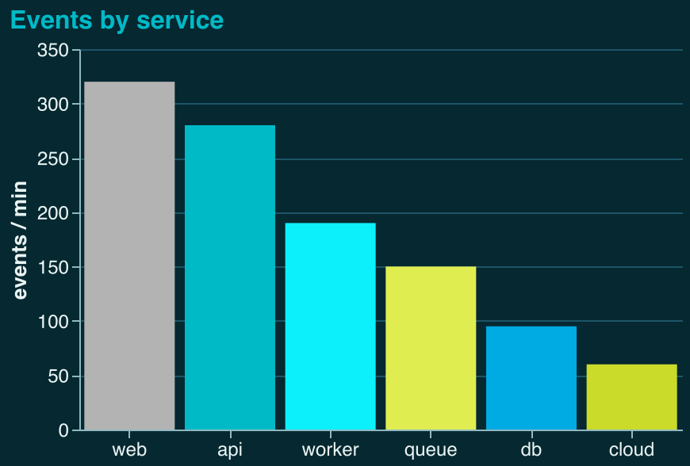 |
| 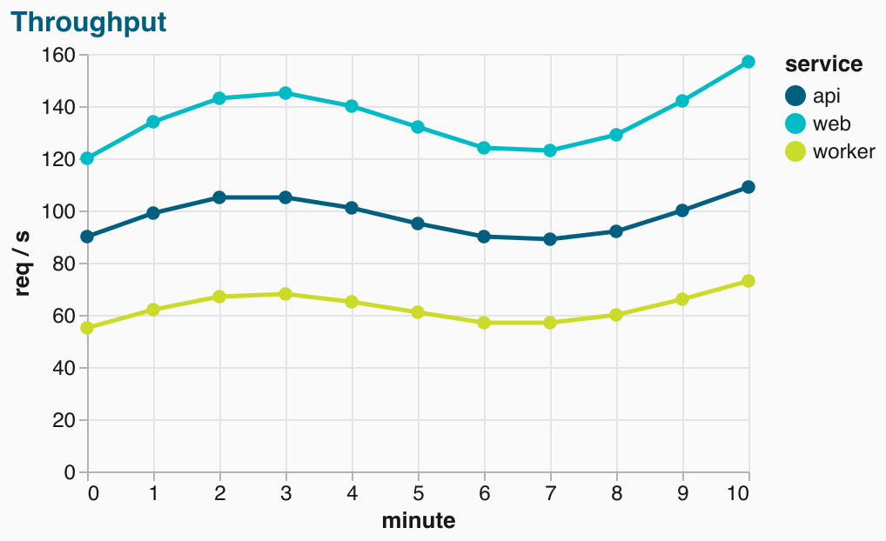 | 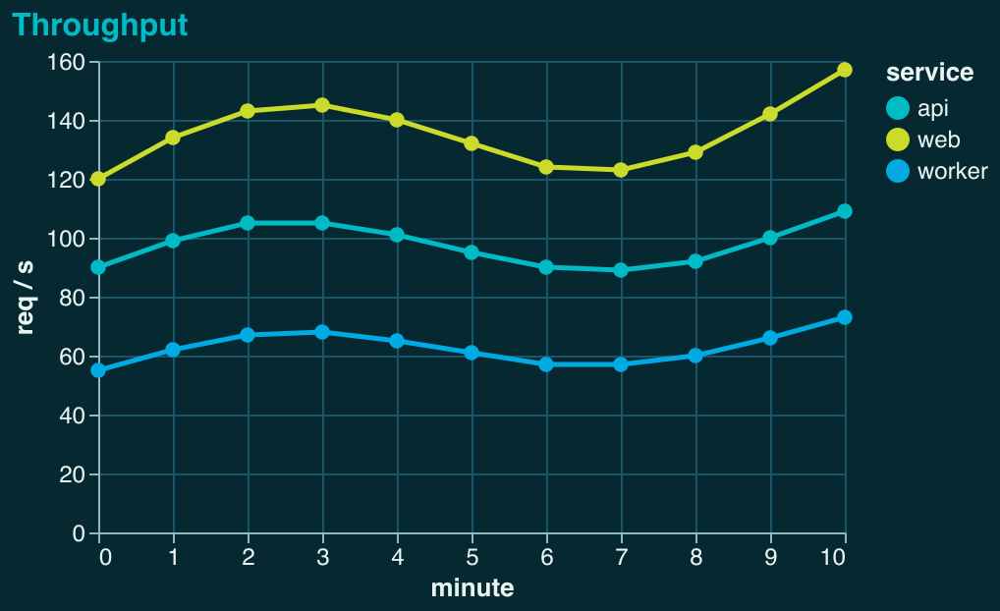 |

Sources (config inlined) live in [`examples/`](examples/).
