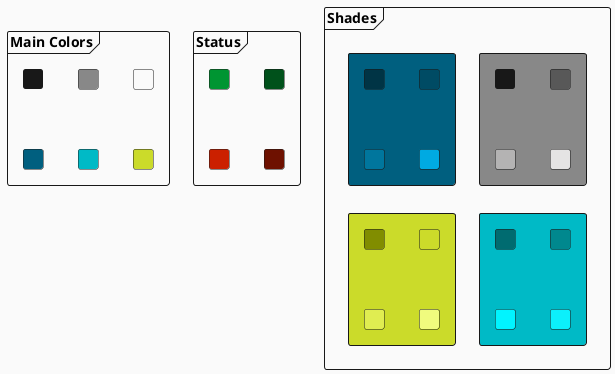

```plantuml
@startuml
<style>
  root {
    FontName Padauk;
    BackgroundColor #FAFAFA;
  }
</style>
frame "Main Colors" {
  rectangle " " as Black #181818
  rectangle " " as Gray #888888
  rectangle " " as White #FAFAFA
  rectangle " " as Main #005F7F
  rectangle " " as Alt #00BAC6
  rectangle " " as Accent #CBDB2A
}

frame "Status" {
  rectangle " " as SuccessLight #009532
  rectangle " " as SuccessDark #00511B
  rectangle " " as ErrorLight #CB2000
  rectangle " " as ErrorDark #6E1100
}

frame "Shades" {
  rectangle #888888 {
    rectangle " " as Gray1 #181818
    rectangle " " as Gray2 #585858
    rectangle " " as Gray3 #B4B3B3
    rectangle " " as Gray4 #E5E4E4
  }
    
  rectangle #005F7F {
    rectangle " " as Main1 #003445
    rectangle " " as Main2 #004B64
    rectangle " " as Main3 #00769D
    rectangle " " as Main4 #00AAE2
  }
    
  rectangle #00BAC6 {
    rectangle " " as Alt1 #006B70
    rectangle " " as Alt2 #00888E
    rectangle " " as Alt3 #01F4FF
    rectangle " " as Alt4 #0CF0FB
  }
  
  rectangle #CBDB2A {
    rectangle " " as Accent1 #818D00
    rectangle " " as Accent2 #CCDB2A
    rectangle " " as Accent3 #E0ED51
    rectangle " " as Accent4 #F0FB7E
  }
}

@enduml
```
