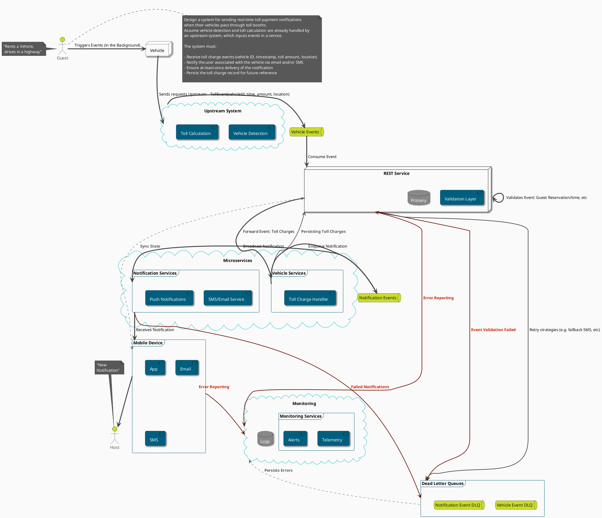

```plantuml
@startuml
!define COLOR_MAIN #005F7F
!define COLOR_ALT #00BAC6
!define COLOR_ACCENT #CBDB2A
!define COLOR_ERROR #6E1100
!define COLOR_SUCCESS #009532
!define COLOR_GRAY #585858

!define PATH_MAIN thickness=3
!define PATH_COMMON thickness=1

!define errorLabel(x) <color:#CB2000><b>x</b></color>
!define successLabel(x) <color:#009532><b>x</b></color>
!define dbLabel(x) <color:#585858><b>x</b></color>

<style>

  root {
    FontName Padauk;
    BackgroundColor #FAFAFA;
  }
  component {
    BackgroundColor #005F7F;
    b1a8d4
    BorderColor #64B5F6;
    FontColor #FAFAFA;
    FontSize 14;
    RoundCorner 10;
    Padding 8;
    Shadowing 2;
  }

  node {
    BackgroundColor #FAFAFA;
    BorderColor #78909C;
    FontSize 14;
    RoundCorner 8;
    Padding 10;
    Shadowing 3;
  }

  database {
    BackgroundColor #888;
    BorderColor #66BB6A;
    FontColor #FAFAFA;
    FontSize 14;
    RoundCorner 8;
    Shadowing 2;
  }

  actor {
    BackgroundColor #CBDB2A;
    BorderColor #FF9800;
    FontColor #585858;
    FontSize 14;
    RoundCorner 8;
    Padding 6;
  }

  queue {
    BackgroundColor #CBDB2A;
    FontColor #121212;
  }

  arrow {
    LineColor #444;
    LineThickness 2;
  }

  note {
    BackgroundColor #585858;
    BorderColor #121212;
    FontColor #FAFAFA;
  }

  cloud {
    LineColor #00BAC6;
  }

  frame {
    LineColor #005F7F;
  }

  folder {
    LineColor #00BAC6;
  }
</style>

actor Guest as G 
actor Host as H

note right of G
  Design a system for sending real-time toll payment notifications 
  when their vehicles pass through toll booths.
  Assume vehicle detection and toll calculation are already handled by 
  an upstream system, which inputs events in a service.
  
  The system must:
  
  - Receive toll charge events (vehicle ID, timestamp, toll amount, location)
  - Notify the user associated with the vehicle via email and/or SMS
  - Ensure at-least-once delivery of the notification
  - Persist the toll charge record for future reference

end note

frame "Mobile Device" as UI {
    component App
    component Email
    component SMS
} 
node "Vehicle" as V
node "REST Service" as API {
  component "Validation Layer"
  database "Primary" as DB
}

cloud "Upstream System" as US {
  component "Vehicle Detection"
  component "Toll Calculation"
}

cloud Microservices {
  frame "Vehicle Services" as VS {
    component "Toll Charge Handler"
  }
  frame "Notification Services" as NS {
    component "SMS/Email Service"
    component "Push Notifications"
  }
}

cloud Monitoring as M {
  frame "Monitoring Services" {
    component Telemetry
    component Alerts
  }
  database Logs
}
queue "Vehicle Events" as VQ
queue "Notification Events" as NQ
frame "Dead Letter Queues" as DQ {
  queue "Vehicle Event DLQ" as VDQ
  queue "Notification Event DLQ" as NDQ
}

G -[PATH_MAIN]> V  : " Triggers Events (in the Background)"
V -[PATH_MAIN]-> US : " Sends requests Upstream"
US -[PATH_MAIN]> VQ :  " TollEvent(vehicleId, time, amount, location)"
VQ -[PATH_MAIN]-> API: " Consume Event"
API -[PATH_MAIN]> API: " Validates Event: Guest Reservation/time, etc"
API -[PATH_MAIN]--> VS : " Forward Event: Toll Charges"
VS -[COLOR_GRAY]left-> API : dbLabel(" Persisting Toll Charges")
VS -[PATH_MAIN]-> NQ : " Enqueue Notification"
NQ -[PATH_MAIN]> NS : " Broadcast Notification"
NS -[PATH_MAIN]-> UI : " Receives Notification"
API -[COLOR_ERROR]-> DQ : errorLabel(" Event Validation Failed")
NS -[COLOR_ERROR]-> DQ : errorLabel("Failed Notifications")
API <--> DQ : " Retry strategies (e.g. fallback SMS, etc)"

API <.[COLOR_GRAY].> UI : dbLabel(" Sync State")
API -[COLOR_ERROR]-> M : errorLabel(" Error Reporting")
UI -[COLOR_ERROR]-> M : errorLabel(" Error Reporting")
M <.[COLOR_GRAY]. DQ : dbLabel("Persists Errors")
UI -[PATH_MAIN]-> H

note left of G: "Rents a Vehicle,\n drives in a highway"
note top of H: "New \nNotification"
@enduml
```
